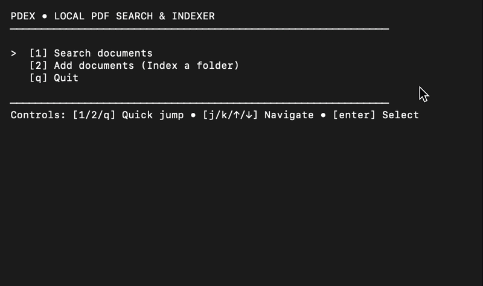

# pdex

A fast CLI/TUI tool written in Go that indexes your local PDFs and lets you search across all of them by keyword, returning ranked results with page numbers and highlighted snippets.

## Features

1.Uses tiered change detection (size/mtime checks followed by partial hashing) to skip unchanged files instantly.

2.Built on SQLite's FTS5 for native BM25-ranked full-text search and snippet generation.

3.An elegant terminal user interface for searching and previewing PDF snippets.

## Demo




## Usage

Index a directory of PDFs:
```bash
pdex index /path/to/pdfs
```

Search your index via the TUI:
```bash
pdex search
```
